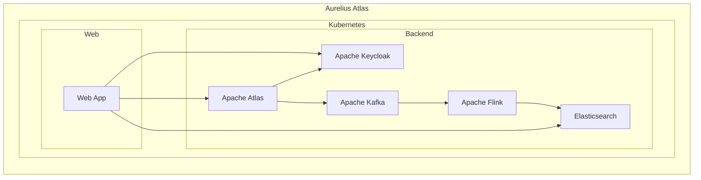

# Architecture

This page describes the architecture of Aurelius Atlas. The system consists of the following main components:

## Web App

The Web App is the main user interface for Aurelius Atlas. It is a single-page application (SPA) built with Angular.
The Web App is responsible for displaying the data stored in Apache Atlas and Elasticsearch. It communicates with
he backend services using REST APIs. Authentication is handled by Apache Keycloak.

## Apache Atlas

Apache Atlas is a metadata management and governance platform. It provides a scalable and extensible set of core
metadata services for data governance. Apache Atlas is used to store metadata about data assets, such as definitions,
relationships, and classifications.

## Apache Keycloak

Apache Keycloak is an open-source identity and access management solution. It acts as the main identity provider
for Aurelius Atlas, handling user authentication and authorization. All interactions with the Web App and backend
services are authenticated and authorized by Apache Keycloak.

## Apache Kafka

Apache Kafka is a distributed event streaming platform. It is used as the messaging backbone for back-end data
processing and integration. Apache Atlas publishes metadata change events to Apache Kafka, which are consumed by
Apache Flink for real-time processing.

## Apache Flink

Apache Flink is a distributed stream processing framework. It is used to process metadata change events from Apache
Atlas in real-time. Apache Flink enriches the metadata events and stores them in Elasticsearch to enable advanced
user queries in the Web App.

## Elasticsearch

Elasticsearch is a distributed search and analytics engine. It is used to store the enriched metadata from Apache
Flink. Elasticsearch provides fast and scalable full-text search capabilities for the Web App.
