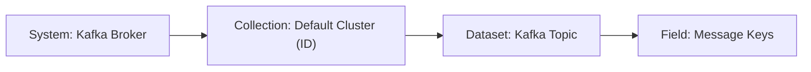
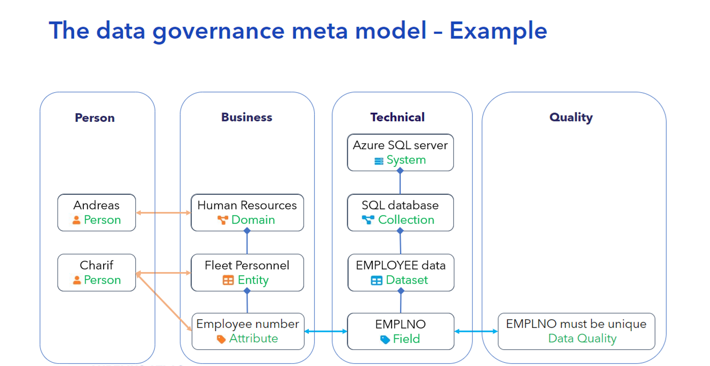

# Onboarding Data Sources

The onboarding of data sources is a key step in creating a cohesive data governance model within Aurelius Atlas.
This guide demonstrates how to onboard two types of data sources into the Aurelius Atlas platform, walking through
the critical steps to integrate, monitor, and manage them effectively.

## Onboarding Data Dictionary from Excel File

Onboarding data from Excel files allows for quick and structured ingestion of tabular data, ideal for business
data dictionaries. This method is suitable when data is prepared in structured spreadsheets.

### Requirements

1. Ensure that data is clean, well-structured, and follows a consistent schema.
2. Data from Excel files must be stored somewhere with access to the kubernetes cluster.

### Technical Description of Excel

Below are the technical descriptions for each relevant column in the excel template.

#### L1 Data Domains

The **L1 Data Domains** sheet categorizes and manages the high-level business data domains. Below is a table
describing the important columns to fill when onboarding a data domain:

| **Column**           | **Description**                                                              |
| -------------------- | ---------------------------------------------------------------------------- |
| **Domain Name**      | The name of the business data domain (e.g., "Employee", "Sales", "Finance"). |
| **Definition**       | A brief description or definition of the data domain.                        |
| **Data Domain Lead** | The email address of the person responsible for managing the data domain.    |

#### L2 Data Entities

The **L2 Data Entities** sheet represents the entities within a specific data domain. This helps track
relationships and ownership between data entities. Below is a table describing the columns to fill for data entities:

| **Column**                    | **Description**                                                                   |
| ----------------------------- | --------------------------------------------------------------------------------- |
| **Data Domain**               | The qualified name of the data domain that the entity belongs to.                 |
| **Entity Name**               | The name of the entity (e.g., "Employee", "Department").                          |
| **Direct Relation to Domain** | Indicates how the entity is directly related to the data domain.                  |
| **Has Parent**                | Whether the entity has a parent entity (e.g., hierarchical structure).            |
| **Parent Entity Name**        | The name of the parent entity, if applicable (e.g., "Department" for "Employee"). |
| **Definition**                | A description or definition of the entity.                                        |
| **Business Data Owner**       | The business owner responsible for the entity's data.                             |
| **Business Data Steward**     | The business data steward overseeing the quality and usage of the entity's data.  |

#### L3 Data Attributes

The **L3 Data Attributes** sheet provides detailed metadata for the individual attributes within entities.
It captures information about each attribute's characteristics, such as its definition and business ownership.
Below is the description of each column:

| **Column**                | **Description**                                                                |
| ------------------------- | ------------------------------------------------------------------------------ |
| **Entity Name**           | The name of the entity that the attribute belongs to.                          |
| **Attribute Name**        | The name of the attribute (e.g., "Employee ID", "Date of Birth").              |
| **Definition**            | The description or purpose of the attribute.                                   |
| **Data Type**             | The data type of the attribute (e.g., string, integer, date).                  |
| **Has PII**               | Whether the attribute contains Personally Identifiable Information (PII).      |
| **Risk Classification**   | The risk classification for the attribute (e.g., High, Low).                   |
| **Is Key Data**           | Whether the attribute is considered a key piece of data (e.g., "Employee ID"). |
| **Business Data Owner**   | The business owner responsible for the attribute's data.                       |
| **Business Data Steward** | The business data steward responsible for the attribute’s quality.             |

#### 4. L4 Fields

The **L4 Fields** sheet deals with the granular details of fields within the attributes. These fields could be
part of larger datasets and define specific characteristics for each field. Below is the description of each column:

| **Column**                | **Description**                                                            |
| ------------------------- | -------------------------------------------------------------------------- |
| **Attribute Name**        | The name of the attribute that the field belongs to.                       |
| **System Name**           | The system or application where the field originates.                      |
| **Collection Name**       | The name of the collection or table in which the field resides.            |
| **Dataset Name**          | The name of the dataset that contains the field.                           |
| **Field Name**            | The specific field name within the collection or dataset.                  |
| **Definition**            | A description of the field's purpose or contents.                          |
| **Field Type**            | The data type of the field (e.g., string, integer, date).                  |
| **Has Content Structure** | Whether the field has a specific content structure (e.g., JSON structure). |

#### Data Quality Rule book

The **Data Quality Rule book** sheet contains guidelines and rules for maintaining the quality of data
throughout its lifecycle. It includes rules for data validation, consistency, completeness, and accuracy.

| **Column**                        | **Description**                                                                                             |
| --------------------------------- | ----------------------------------------------------------------------------------------------------------- |
| **Business Rule Description**     | A description of the business rule related to the field.                                                    |
| **Data Quality Rule Description** | A detailed description of the data quality rule, including the validation logic and expected data behavior. |
| **Data Quality Dimension**        | The specific dimension of data quality being evaluated.                                                     |
| **Filter Required**               | Whether a filter is required to apply the data quality rule.                                                |
| **Expression**                    | The expression or formula used to validate the data.                                                        |
| **Active**                        | Indicates whether the data quality rule is active.                                                          |
| **Expression Version**            | The version of the expression, indicating which iteration of the rule is being applied.                     |
| **Field Qualified Name**          | The fully qualified name of the field associated with the data quality rule.                                |

#### Person Table

The **Person Table** is used to track and manage individuals who are responsible for various aspects of data governance.

| **Column**        | **Description**                                  |
| ----------------- | ------------------------------------------------ |
| **Person Name**   | The name of the person.                          |
| **Email Address** | The email address for contacting the individual. |

#### Process

The **Process** sheet provides detailed information about the systems and processes that govern the flow of
data. It includes input and output data, along with details about the process itself.

| **Column**            | **Description**                                            |
| --------------------- | ---------------------------------------------------------- |
| **System Name**       | The name of the system involved in the process.            |
| **Process Name**      | The name of the process.                                   |
| **Input 1, 2, 3, 4**  | The input data or parameters required for the process.     |
| **Output 1, 2, 3, 4** | The output data or results generated by the process.       |
| **Definition**        | A brief description of the process.                        |
| **Process Owner**     | The person or team responsible for overseeing the process. |

### Running the module

- Update the `values.yaml` file

| Key                                        | Description                                                              |
| ------------------------------------------ | ------------------------------------------------------------------------ |
| `{{ .Values.global.external_hostname }}`   | Specifies the domain name used for accessing the application.            |
| `{{ .Values.onboard_sources.source }}`     | Indicates the source type for onboarding, such as `excel` or `kafka`.    |
| `{{ .Values.onboard_sources.excel_file }}` | Defines the path or location of the Excel file used for onboarding data. |

- Create a ConfigMap with the Excel file data:

    ```bash
    kubectl create configmap excel-config --from-file=<my_excel_file.xlsx> -n <namespace>
    ```

- Apply the deployment:

```bash
helm template -s templates/onboard-sources.yaml . -n demo | kubectl apply -f -
```

## Onboarding Data from Kafka System

Onboarding data from Kafka allows for real-time ingestion of event-driven data streams, helping users
to locate Kafka topics, understand topic structures, and incorporate message metadata into Aurelius Atlas.
This integration is particularly useful for organizations working with large, dynamic datasets generated
by distributed systems.

### Data Model

In this onboarding method, Kafka topics are connected to Aurelius Atlas as datasets.
These topics contain message keys and other metadata, which are structured into the Aurelius Atlas data model
for improved searchability and discovery. Following this approach ensures that Kafka topics are organized
within a consistent governance structure, promoting data accessibility and transparency.



- **System** - Kafka Broker:

    This component is the Kafka Broker that represents the technical system.

- **Collection** - Default Cluster (ID)

    This refers to a specific Kafka cluster that organizes and manages topics.

- **Dataset** - Kafka Topic

    A Kafka topic is a category or feed name to which messages are published.

- **Field** - Message keys

    This refers to the keys associated with the messages in a topic.

This process creates the data dictionary but does not include descriptions. Adding descriptions in the
Aurelius Atlas tool is important for improving data understanding.

### Running the onboarding module

The module can be run with a Kubernetes job. Please follow the steps below:

- Update the `values.yaml` file

| Key                                                 | Description                                                                        |
| --------------------------------------------------- | ---------------------------------------------------------------------------------- |
| `{{ .Values.global.external_hostname }}`            | Specifies the external hostname or domain name used for accessing the application. |
| `{{ .Values.onboard_sources.source }}`              | Indicates the source type for onboarding, such as API, file, or database.          |
| `{{ .Values.onboard_sources.bootstrap_servers }}`   | The Kafka bootstrap servers to connect to.                                         |
| `{{ .Values.onboard_sources.schema_registry_url }}` | The URL of the schema registry.                                                    |

- Run the `onboard-sources.yaml` job:

    Ensure that these files are not listed in the `.helmignore` file.

    ```bash
    helm template -s templates/onboard-sources.yaml . -n demo | kubectl apply -f -
    ```

## Onboarding General Data Sources

Onboarding general data sources into Aurelius Atlas involves a 5-step process to ensure seamless integration
and governance. This approach is designed for sources that do not fit predefined templates like Excel files or
Kafka streams but still require standardized ingestion and oversight.

### Methodology

The methodology for onboarding general data sources involves identifying the source type, establishing
connectivity, and mapping the source schema to the Aurelius Atlas data governance model. Below are the key steps:

#### 1. Assessment and Preparation

- Evaluate the source system to determine the format (e.g., API, relational database, file system, or cloud storage).

- Ensure the source data is clean, structured.

#### 2. Define Data Source Configuration

- Configure the required connection details, such as API endpoints, database credentials,
    file paths, or storage buckets.

- Map the source metadata, including field names, types, and any hierarchical relationships, to Aurelius
    Atlas's internal data model. For more details, please see [below](#data-model-components).

#### 3. Schema Mapping

- Identify key entities, attributes, and relationships in the source data. For examples, please see [our data model](#data-model-components).

- Map these entities based on Atlas's internal data model.

#### 4. Integrate and Test

- Use Apache Atlas API and our [our data model](https://github.com/aureliusenterprise/aurelius/tree/main/libs/m4i-atlas-core)
    to ingest the data. This can be done with the `ATLAS` user, for examples, see the onboarding with Kafka example.

- Verify that the ingested data aligns with the governance model.

#### 5. Automation and Monitoring

- Automate the ingestion process using Kubernetes jobs or scheduled pipelines.

- Monitor the data source for changes or updates, and re-ingest if required.

### Data Model Components



The Data Model is composed of four foundational pillars: Person, Business, Technical, and quality.

For in-depth technical details, refer to our [m4i-atlas-core](https://github.com/aureliusenterprise/aurelius/tree/main/libs/m4i-atlas-core)
library.

#### How the Pillars Work Together

The four pillars of our Data Governance Model work together to ensure data is responsibly managed,
strategically aligned, and compliant with organizational policies:

- Person ensures oversight and accountability for the data.
- Business defines what data is needed and how it should be structured to meet organizational goals.
- Technical implements the systems and processes required to store, process, and transport the data.
- Quality ensures the data is accurate, consistent, and reliable across its lifecycle.

Together, these pillars create a unified framework that ensures responsible data management
fosters compliance with regulatory requirements, and enables effective data-driven decision-making.

#### Person

The Person pillar focuses on the human element of data management. It captures roles and responsibilities for
governance, ensuring effective oversight throughout the data lifecycle.

For more information and examples on how to use the class please visit: [Atlas Person](https://github.com/aureliusenterprise/aurelius/blob/main/libs/m4i-atlas-core/m4i_atlas_core/entities/atlas/data_dictionary/AtlasPerson.py)

#### Business Entities

The Business pillar defines the organizational perspective on data, emphasizing its role in operations,
strategy, and decision-making. It bridges the gap between business goals and data management by providing
context for data usage in reporting, analysis, and operations.

Key Components:

- **Domain**: High-level categorization of data areas (e.g., Order Management, Customer Information).
    For more information, visit: [Data Domain](https://github.com/aureliusenterprise/aurelius/blob/main/libs/m4i-atlas-core/m4i_atlas_core/entities/atlas/data_dictionary/BusinessDataDomain.py)

- **Entity**: Specific objects or records within a domain (e.g., Customer Orders).
    For more information, visit: [Data Entity](https://github.com/aureliusenterprise/aurelius/blob/main/libs/m4i-atlas-core/m4i_atlas_core/entities/atlas/data_dictionary/BusinessDataEntity.py)

- **Attribute**: Properties or characteristics of an entity (e.g., Order ID, Customer Name).
    For more information, visit: [Data Attribute](https://github.com/aureliusenterprise/aurelius/blob/main/libs/m4i-atlas-core/m4i_atlas_core/entities/atlas/data_dictionary/BusinessDataAttribute.py)

#### Technical Entities

The Technical pillar focuses on the operational aspects of data, including its storage, processing, and flow
through systems. This perspective ensures seamless integration and management of data across IT systems

Key Components:

- **System**: Platforms or tools involved in data processing (e.g., Kafka Broker, Node-RED).

    For more information, visit: [System](https://github.com/aureliusenterprise/aurelius/blob/main/libs/m4i-atlas-core/m4i_atlas_core/entities/atlas/data_dictionary/BusinessSystem.py)

- **Collection**: Logical groupings of datasets or streams (e.g., Kafka Clusters).

    For more information, visit: [Collection](https://github.com/aureliusenterprise/aurelius/blob/main/libs/m4i-atlas-core/m4i_atlas_core/entities/atlas/data_dictionary/BusinessCollection.py)

- **Dataset**: Structured or semi-structured data containers (e.g., IoT-Expo-Metrics-Avro).

    For more information, visit: [Dataset](https://github.com/aureliusenterprise/aurelius/blob/main/libs/m4i-atlas-core/m4i_atlas_core/entities/atlas/data_dictionary/BusinessDataset.py)

- **Field**: Specific data points or columns within a dataset (e.g., Order_ID).

    For more information, visit: [Field](https://github.com/aureliusenterprise/aurelius/blob/main/libs/m4i-atlas-core/m4i_atlas_core/entities/atlas/data_dictionary/BusinessField.py)

#### Quality

The Quality pillar enforces standards, rules, and validation processes to maintain data integrity, accuracy,
and consistency. It underpins trust in the data by ensuring it meets both business and technical standards.

For more information, visit: [Data Quality](https://github.com/aureliusenterprise/aurelius/blob/main/libs/m4i-atlas-core/m4i_atlas_core/entities/atlas/data_dictionary/BusinessDataQuality.py)
