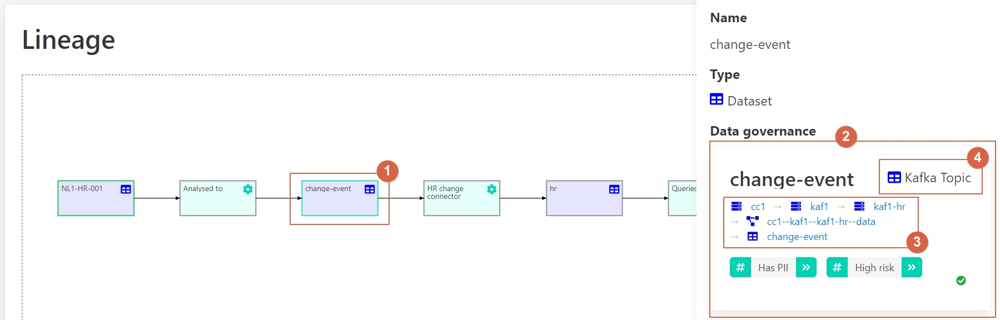
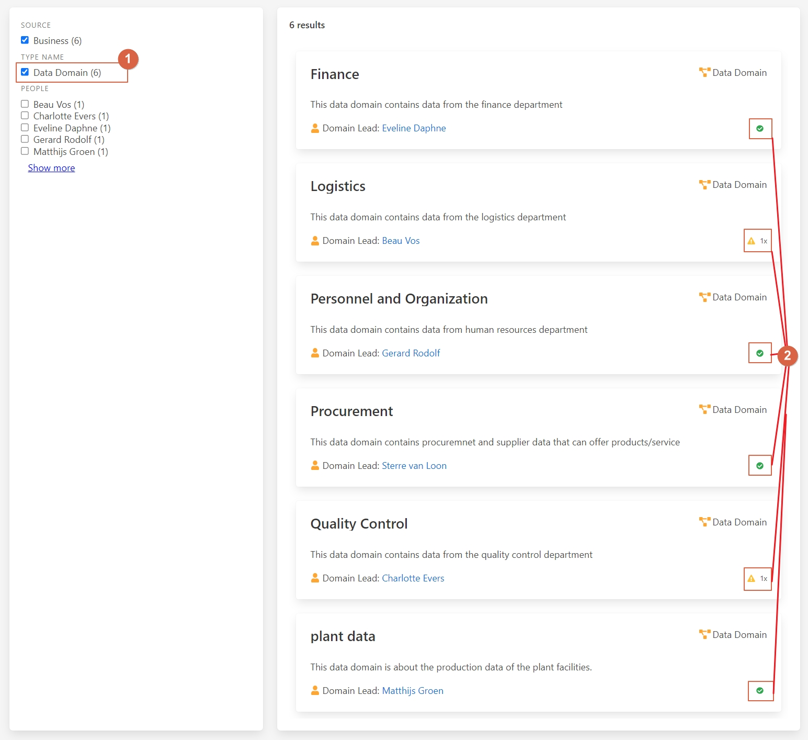
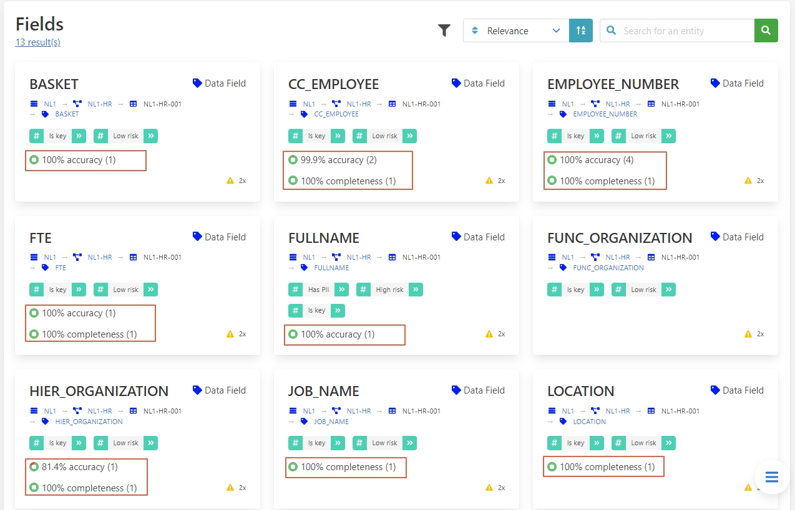
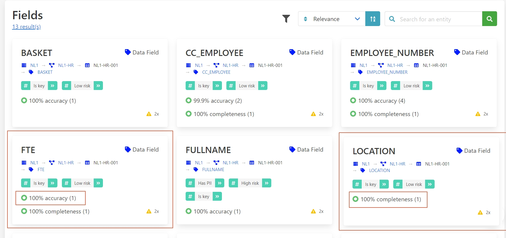

# User Stories

This page provides a collection of common scenarios that illustrate how Aurelius Atlas can help users address
common data governance challenges. Each user story highlights a specific use case and includes a walkthrough
to demonstrate how the platform can be used to solve the problem.

## Cross-Platform Data Governance

Organizations often use a mix of solutions from different vendors, incorporating various
clouds and on-premise systems. Data governance solutions from different cloud providers
focus on their specific platforms, making it difficult for organizations to get a comprehensive
overview of available data and data flows across all solutions.

### Challenges

1. **Fragmented Data Governance**: Different platforms have isolated governance solutions.
2. **Lack of Unified Data Catalog**: No central repository to find and manage data across platforms.
3. **Data Flow Visibility**: Difficult to trace data lineage across multiple systems.

### Benefits and Features

- **Unified Data Governance**: Aurelius Atlas collects governance information from various systems.
- **Comprehensive Data Catalog**: Serves as a central repository for organization-wide data.
- **Cross-Platform Data Lineage**: Visualizes data flows across different environments.

### Walkthrough

Consider that we want to update the schema of a particular table in our data pipeline. We need to
know who is using the data and where it is being used to ensure all schemas and pipelines
are adjusted accordingly.

!!! tip
    You can follow along with the scenario on the Aurelius Atlas demo environment.

    <a class="btn btn-success" href="https://aureliusdev.westeurope.cloudapp.azure.com/demo/atlas/">Go to the demo</a>

#### Step-by-Step Guide

Start by searching for the table **NL1-HR-001** within the technical context.

Navigate through the search results to locate and click on the entity with type _Dataset_ for more detailed
information.

Once on the entity page of **NL1-HR-001**, you will see an overview providing essential details such as the
entity's name and type, its hierarchical breadcrumb, a description, and a summary of all elements available on
the page. Additionally, you can check the availability of the lineage model and find a navigation button for
quick access to related sections.

To explore the data lineage of **NL1-HR-001**, locate and click on the "Lineage Model" option provided either
in segment 5 or via the navigation button in segment 6.

The lineage analysis reveals that the data originates from a relational database, providing critical insights
into its storage location and other pertinent details, as depicted in the image below:

From here, follow the data flow as it progresses into a Kafka topic. This step ensures effective communication
of change events through Change Data Capture (CDC). You can examine the source code and specifics of how the
data is stored and converted into a Kafka topic:

Next, explore the final destination of the data, which is stored in an Elastic Search index. Understand the
source code and detailed attributes associated with this storage, including the transformation process into
an Elastic index:

In the lineage graph of **NL1-HR-001**, visualize the comprehensive data flow across different systems,
including SQL server, Kafka, and Elastic. Aurelius Atlas ensures consistent data recording and visibility
across these varied environments:

For more specific details, such as those related to the **hr** entity, click to uncover additional insights
about this particular component:

Finally, review the available data in a Kibana dashboard. Click on the last event depicted in the lineage
model to access and explore this comprehensive dashboard, which provides detailed information about the
entity and its usage:

By following these steps, you can effectively trace the data lineage across multiple cloud solutions and
ensure all subsequent processing is adjusted as required. As a result, we can update our schema accordingly.

## Data Discovery

In a data analytics project, **data scientists** or **data engineers** often need to find specific data to answer
critical business questions. However, identifying relevant data, understanding where it is stored, and knowing
who to contact for access can be challenging, especially in organizations lacking data governance tools. This
process typically involves reaching out to multiple people and can be time-consuming and inefficient.

### Challenges

1. Lack of visibility into available data.
2. Uncertainty about data storage locations.
3. Difficulty identifying the accountable individuals for data access.
4. Time-consuming processes to understand data attributes and their meanings.
5. Inefficiency for engineers, particularly those with smaller networks within the organization.

### Benefits and Features

Aurelius Atlas provides a centralized solution that makes information
about data availability, storage locations, and accountable contacts
easily accessible. The tool facilitates quicker and more efficient
data discovery and access, reducing the time and effort required to
find and understand relevant data.

#### Business Context

Users can search for data by entering relevant terms related to their
business context. The platform shows which data sets are available that
match the search criteria. Comprehensive explanations of individual atomic
attributes help users understand the meaning and relevance of the data.

#### Storage Locations

Information about where the data is stored is readily accessible.

#### Accountability

Users can see who is responsible for the data, making it easier to request access.

### Walkthrough

Let's consider a scenario where a data scientist needs to calculate the number
of people who currently work for their company as part of the annual report.
Therefore, the data scientist needs to know:

- Where is the data stored?
- Who do I need to ask for permission to access the data?

!!! tip
    You can follow along with the scenario on the Aurelius Atlas demo environment.

    <a class="btn btn-success" href="https://aureliusdev.westeurope.cloudapp.azure.com/demo/atlas/">Go to the demo</a>

Watch the video walkthrough below or read the step-by-step instructions.

<iframe
    width="560"
    height="315"
    src="https://www.youtube-nocookie.com/embed/gt-NzPn5KCU?si=ASCaTPWaTLI8-8MO"
    title="YouTube video player"
    frameborder="0"
    allow="accelerometer; autoplay; clipboard-write; encrypted-media; gyroscope; picture-in-picture; web-share"
    referrerpolicy="strict-origin-when-cross-origin"
    allowfullscreen
>
</iframe>

#### Step-by-Step Guide

Let's start on the Aurelius Atlas landing page. Here, the data scientist
can enter search terms like _employee_, _staff_, or _workforce_. See the
screenshot below.

Here's an explanation of the highlighted elements:

1. **Business Context**: The landing page has a dedicated section to help you
    get started exploring the business context of the data. You can enter search terms related
    to your business question to find relevant data sets.
2. **Info Panel**: Click the question mark icon for an explanation of the business context meta model.
3. **Search Bar**: Queries made through this search bar will have business context filters pre-applied.

To search for employees, click the search icon and enter the term _employee_.
This will generate a list of results related to employees.

As a data scientist seeking entities representing employees, use the sidebar to
drill down and filter the results by data entities. Applying this filter will
narrow the results to 4 entities.

With this smaller set of results, review each entity individually. Compare the
entities _Personnel_ and _Internal_ by examining their breadcrumbs. The breadcrumbs
indicate that _Internal_ is a child entity of _Personnel_, showing a hierarchical
relationship between these concepts.

We are only interested in permanent employees, therefore select the entity
_Internal_. That will take us to the details of the entity.

In this overview, we can find the following segments:

1. Name and Type of the Entity
2. Business Hierarchy: Shows which domain this entity is related to.
3. Description
4. People Responsible for this Data
5. Summary of All the Elements of the Page
6. Button to Navigate Through Each Section Quickly

From this overview, we can effectively answer one of our questions:
_Who do I need to ask for permission to access the data?_
**Merel Hofman** ✔.

However, we still need to find out where this data is stored.
Therefore, click on _datasets_ in segment (5) or use the navigation button (6).

As we scroll down to the dataset section, we find a new set of
descriptions and functionalities such as:

1. Results of the Datasets
2. Name of the Dataset and Where It Is Located in the Hierarchy
3. Filter Down the Datasets
4. Look for the Entities Inside This Dataset
5. Type of Storage

As we zoom in on the dataset's breadcrumbs, we can answer our
remaining questions. _Where is the data stored?_ 
**N1L** -> **NL1-HR** -> **NL1-HR-001** ✔.

In summary, streamlining data discovery is crucial for data scientists and engineers who need quick access to
relevant data for critical business questions. Aurelius Atlas addresses the common challenges in
this process by providing a centralized platform that enhances visibility into available
data, its storage locations, and the responsible contacts

## Data Governance Quality

Implementing data management in an organization involves multiple facets: setting up the data governance
organization, establishing business and technical data governance models, and monitoring data quality. Keeping
track of progress across these activities can be challenging. Aurelius Atlas provides a comprehensive tool for
key stakeholders to monitor implementation progress and data governance quality, aiding better decision-making
for future improvements.

### Challenges

1. **Comprehensive Oversight**: Difficulty in monitoring progress across various data governance activities.
2. **Quality Assurance**: Ensuring data governance rules are followed across the organization.
3. **Prioritization**: Identifying areas needing immediate attention for improvement.
4. **Transparency**: Communicating the status of data governance compliance to stakeholders.

### Benefits and Features

- **Holistic Monitoring**: Track implementation progress and data governance quality.
- **Rule Compliance**: Assess compliance with data governance rules for each entity.
- **Quality Scores**: Provide overall data governance quality scores for entities.
- **Actionable Insights**: Identify potential issues and focus on necessary improvements.

### Walkthrough

Consider a business data steward responsible for maintaining data governance quality in their domain. The steward
uses Aurelius Atlas to review potential issues and delve into the details.

!!! tip
    You can follow along with the scenario on the Aurelius Atlas demo environment.

    <a class="btn btn-success" href="https://aureliusdev.westeurope.cloudapp.azure.com/demo/atlas/">Go to the demo</a>

Watch the video walkthrough below or read the step-by-step instructions.

<iframe
    width="560"
    height="315"
    src="https://www.youtube.com/embed/q6yFKAfdbSk?si=Rm-DLwhgZdBGksc1"
    title="YouTube video player"
    frameborder="0"
    allow="accelerometer; autoplay; clipboard-write; encrypted-media; gyroscope; picture-in-picture; web-share"
    referrerpolicy="strict-origin-when-cross-origin"
    allowfullscreen
>
</iframe>

#### Step-by-Step Guide

Let's begin by searching for the "Logistics" domain within Aurelius Atlas to assess its data governance quality.
Click on the button as shown in the image below:

Icons such as data type indicators, check marks for fully populated entities, and warning symbols for incomplete
ones help us quickly identify areas needing attention.

Next, click on the "Logistics" entity flagged with a warning symbol to investigate further:

This section provides a detailed view of each field's quality, helping you identify areas that may require
improvement. For instance, you might notice that fields like "FTE" and "location" meet your quality standards,
while others, such as "HIER ORGANIZATION" exhibit lower precision.

To gain deeper insights into the specific data quality issues affecting "HIER ORGANIZATION" navigate to the data
quality rules section.

Here, you can assess the compliance status of the "Logistics" entity with the applied data governance rules:

Check if all required data entities are complete or if there are any missing elements that require attention.

By following these steps, you can effectively monitor and improve data governance quality, ensuring compliance
with established rules and standards across your organization.

## Data Lineage

In organizations, data from various sources undergoes transformation using specific technologies, involving
multiple steps where changes can impact downstream processes. Data scientists and integration experts rely on
impact analysis to assess these effects. They face challenges such as dependency management, unclear data lineage,
complex impact assessment, and identifying ownership.

### Challenges

1. **Dependency Management**: Overlooking dependent steps can lead to data processing failures.
2. **Data Lineage Clarity**: Lack of visibility into data flow complicates tracing origins.
3. **Impact Assessment**: Assessing changes across interconnected systems is time-consuming.
4. **Ownership Identification**: Identifying responsible parties for data usage is challenging.

### Benefits and Features

- **Data Integrity**: Visualizing data lineage ensures reliability.
- **Change Management**: Tools assess schema or transformation impacts.
- **Data Governance**: Tracks data usage and responsibilities.
- **Efficiency**: Centralized access accelerates decision-making.

### Walkthrough

Consider an implementer extending a table schema to ensure subsequent processing adjustments.

#### Step-by-Step Guide

The table we want to extend is **NL1-HR-001**. Since we're interested in the
technical specifications of the table, use the Technical Context
search input and search for **NL1-HR-001**.

We will receive a list of all results related to **NL1-HR-001**. We are
interested in the table, so click on the entity **NL1-HR-001** with type _Dataset_.
0

In this overview, we find the following segments:

1. Name and type of the entity.
2. Breadcrumb showing the entity hierarchy.
3. Description of the entity.
4. Summary of all page elements.
5. Lineage model availability.
6. Navigation button for quick access.

We are looking for the data lineage. Therefore, click on _Lineage Model_
in segment (5) or use the navigation button (6).

The lineage model shows the position of the entity in the data flow. It clarifies
where the data comes from and where it flows to. In this case, we see that the
entity **NL1-HR-001** is a source dataset used and processed in the organization.

To get details of each entity in the lineage model, click on the icon in the
image to open the detail panel on the right-hand side.

In the details, we find:

1. Name and type of the entity.
2. Summary of data governance metrics.
3. Properties of the entity.

Let’s follow the flow of the data. If you click on the next entity called Change-event,
you can see how the data changes to a Kafka topic. Thereafter, you can see
that this Kafka topic converts into an Elastic index.

With the lineage graph, you can see where the data is going and where it comes from.
This is not limited to a particular system but spans across different
applications and environments tracking governance information. Following these steps,
the implementer can learn where the data is used and what subsequent processing can
be affected by extending the schema.

## Data Quality Management

Data quality is a crucial aspect of data management, ensuring data is useful and reliable, leading
to better business outcomes. Poor data quality, on the other hand, can result in misleading
indicators, ineffective decision-making, and wasted resources.

### Challenges

1. **Error-Prone Data**: Inaccurate data can lead to wrong business decisions.
2. **Incomplete Data**: Missing values reduce the usability of datasets.
3. **Outdated Data**: Data that is not current can mislead analysis.
4. **Lack of Uniqueness**: Duplicate entries can cause inconsistencies.
5. **Invalid Data**: Data that does not fit predefined formats can lead to processing errors.

### Benefits and Features

- **Comprehensive Data Quality Metrics**: Measures accuracy, completeness, timeliness, uniqueness, and validity.
- **Data Quality Scoring**: Provides a percentage score for each quality rule, highlighting areas of improvement.
- **Root Cause Analysis**: Helps identify and address the origins of data quality issues.
- **Cross-Platform Data Quality Insights**: Tracks data quality across different systems and transformations.

### Walkthrough

Consider a data engineer who needs high-quality data for a new analysis. The engineer uses
Aurelius Atlas to discover and evaluate the data quality of a candidate dataset.

!!! tip
    You can follow along with the scenario on the Aurelius Atlas demo environment.

    <a class="btn btn-success" href="https://aureliusdev.westeurope.cloudapp.azure.com/demo/atlas/">Go to the demo</a>

Watch the video walkthrough below or read the step-by-step instructions.

<iframe
    width="560"
    height="315"
    src="https://www.youtube.com/embed/QBZ80l5jpvE?si=nWc-ig7RxbGnq8ce"
    title="YouTube video player"
    frameborder="0"
    allow="accelerometer; autoplay; clipboard-write; encrypted-media; gyroscope; picture-in-picture; web-share"
    referrerpolicy="strict-origin-when-cross-origin"
    allowfullscreen
>
</iframe>

#### Step-by-Step Guide

Imagine you're a data engineer tasked with ensuring high-quality data for a new analysis using Aurelius Atlas.
Start by navigating directly to the details page of the dataset you intend to use.

Here, you'll find an overview of its data quality metrics, which include measures such as accuracy, completeness,
timeliness, uniqueness, and validity. This initial view allows you to understand the overall quality status of
the dataset.

Next, assess the quality of each field by navigating to the field details section.

This section provides a detailed view of each field's quality, helping you identify areas that may require
improvement. For instance, you might notice that fields like "FTE" and "location" meet your quality standards,
while others, such as "HIER ORGANIZATION," exhibit lower precision.

To gain deeper insights into the specific data quality issues affecting "HIER ORGANIZATION," navigate to the data
quality rules section.

Here, you can review all applied rules and their respective scores. For example, you might discover that
inconsistencies in the syntax of the "HIER ORGANIZATION" field contribute to its lower quality score.

To understand the implications of these findings and identify who within your organization is responsible for
addressing these quality issues, navigate to the data attributes section.

This section provides detailed information about each attribute, including contact details for individuals
accountable for the data. It helps you understand what each field represents and enables you to collaborate
effectively to enhance data accuracy, completeness, and reliability for your analysis.

By following these steps in Aurelius Atlas, you gain clarity on the quality measures applied to your dataset and
can take actionable steps to ensure high-quality data for your analysis.
