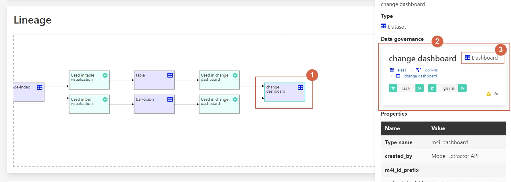

# Cross-Platform Data Governance

Organizations often use a mix of solutions from different vendors, incorporating various
clouds and on-premise systems. Data governance solutions from different cloud providers
focus on their specific platforms, making it difficult for organizations to get a comprehensive
overview of available data and data flows across all solutions.

## Challenges

1. **Fragmented Data Governance**: Different platforms have isolated governance solutions.
2. **Lack of Unified Data Catalog**: No central repository to find and manage data across platforms.
3. **Data Flow Visibility**: Difficult to trace data lineage across multiple systems.

## Benefits and Features

- **Unified Data Governance**: Aurelius Atlas collects governance information from various systems.
- **Comprehensive Data Catalog**: Serves as a central repository for organization-wide data.
- **Cross-Platform Data Lineage**: Visualizes data flows across different environments.

## Walkthrough

Consider that we want to update the schema of a particular table in our data pipeline. We need to
know who is using the data and where it is being used to ensure all schemas and pipelines
are adjusted accordingly.

### Step-by-Step Guide

Start by searching for the table **NL1-HR-001** within the technical context.

Navigate through the search results to locate and click on the entity with type _Dataset_ for more detailed
information.

Once on the entity page of **NL1-HR-001**, you will see an overview providing essential details such as the
entity's name and type, its hierarchical breadcrumb, a description, and a summary of all elements available on
the page. Additionally, you can check the availability of the lineage model and find a navigation button for
quick access to related sections.

To explore the data lineage of **NL1-HR-001**, locate and click on the "Lineage Model" option provided either
in segment 5 or via the navigation button in segment 6.

The lineage analysis reveals that the data originates from a relational database, providing critical insights
into its storage location and other pertinent details, as depicted in the image below:

From here, follow the data flow as it progresses into a Kafka topic. This step ensures effective communication
of change events through Change Data Capture (CDC). You can examine the source code and specifics of how the
data is stored and converted into a Kafka topic:

Next, explore the final destination of the data, which is stored in an Elastic Search index. Understand the
source code and detailed attributes associated with this storage, including the transformation process into
an Elastic index:

In the lineage graph of **NL1-HR-001**, visualize the comprehensive data flow across different systems,
including SQL server, Kafka, and Elastic. Aurelius Atlas ensures consistent data recording and visibility
across these varied environments:

For more specific details, such as those related to the **hr** entity, click to uncover additional insights
about this particular component:

Finally, review the available data in a Kibana dashboard. Click on the last event depicted in the lineage
model to access and explore this comprehensive dashboard, which provides detailed information about the
entity and its usage:

By following these steps, you can effectively trace the data lineage across multiple cloud solutions and
ensure all subsequent processing is adjusted as required.
