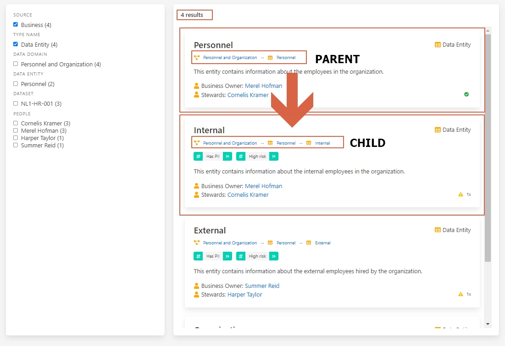
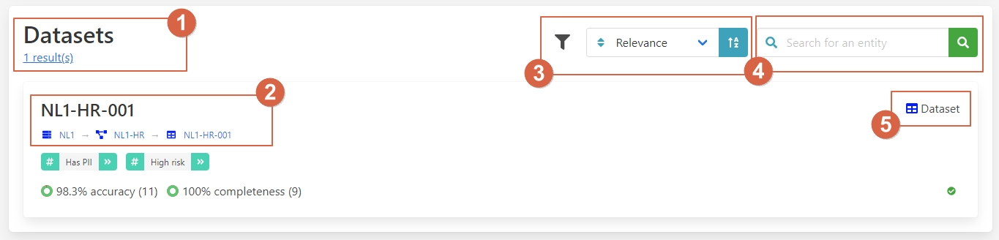

# Streamlining Data Discovery

In a data analytics project, **data scientists** or **data engineers**
often need to find specific data to answer critical business questions.
However, identifying relevant data, understanding where it is stored, and
knowing who to contact for access can be challenging, especially in
organizations lacking data governance tools. This process typically
involves reaching out to multiple people and can be time-consuming
and inefficient.

## Challenges

1. Lack of visibility into available data.
2. Uncertainty about data storage locations.
3. Difficulty identifying the accountable individuals for data access.
4. Time-consuming processes to understand data attributes and their meanings.
5. Inefficiency for engineers, particularly those with smaller networks within the organization.

## Benefits and Features

Aurelius Atlas provides a centralized solution that makes information
about data availability, storage locations, and accountable contacts
easily accessible. The tool facilitates quicker and more efficient
data discovery and access, reducing the time and effort required to
find and understand relevant data.

### Business Context

Users can search for data by entering relevant terms related to their
business context. The platform shows which data sets are available that
match the search criteria. Comprehensive explanations of individual atomic
attributes help users understand the meaning and relevance of the data.

### Storage Locations

Information about where the data is stored is readily accessible.

### Accountability

Users can see who is responsible for the data, making it easier to request access.

## Walkthrough

Let's consider a scenario where a data scientist needs to calculate the number
of people who currently work for their company as part of the annual report.
Therefore, the data scientist needs to know:

- Where is the data stored?
- Who do I need to ask for permission to access the data?

!!! tip
    You can follow along with the scenario on the Aurelius Atlas demo environment.

    <a class="btn btn-success" href="https://aureliusdev.westeurope.cloudapp.azure.com/demo/atlas/">Go to the demo</a>

Watch the video walkthrough below or read the step-by-step instructions.

<iframe
    width="560"
    height="315"
    src="https://www.youtube-nocookie.com/embed/gt-NzPn5KCU?si=ASCaTPWaTLI8-8MO"
    title="YouTube video player"
    frameborder="0"
    allow="accelerometer; autoplay; clipboard-write; encrypted-media; gyroscope; picture-in-picture; web-share"
    referrerpolicy="strict-origin-when-cross-origin"
    allowfullscreen
>
</iframe>

### Searching for Data

Let's start on the Aurelius Atlas landing page. Here, the data scientist
can enter search terms like _employee_, _staff_, or _workforce_. See the
screenshot below.

Here's an explanation of the highlighted elements:

1. **Business Context**: The landing page has a dedicated section to help
2. you get started exploring the business
3. context of the data. You can enter search terms related to your business
4. question to find relevant data sets.
5. **Info Panel**: Click the question mark icon for an explanation of the
6. business context meta model.
7. **Search Bar**: Queries made through this search bar will have business
8. context filters pre-applied.

To search for employees, click the search icon and enter the term _employee_.
This will generate a list of results related to employees.

As a data scientist seeking entities representing employees, use the sidebar to
drill down and filter the results by data entities. Applying this filter will
narrow the results to 4 entities.

With this smaller set of results, review each entity individually. Compare the
entities _Personnel_ and _Internal_ by examining their breadcrumbs. The breadcrumbs
indicate that _Internal_ is a child entity of _Personnel_, showing a hierarchical
relationship between these concepts.

We are only interested in permanent employees, therefore select the entity
_Internal_. That will take us to the details of the entity.

In this overview, we can find the following segments:

1. **Name and Type of the Entity**
2. **Business Hierarchy**: Shows which domain this entity is related to.
3. **Description**
4. **People Responsible for this Data**
5. **Summary of All the Elements of the Page**
6. **Button to Navigate Through Each Section Quickly**

From this overview, we can effectively answer one of our questions:
_Who do I need to ask for permission to access the data?_
**Merel Hofman** ✔.

However, we still need to find out where this data is stored.
Therefore, click on _datasets_ in segment (5) or use the navigation button (6).

As we scroll down to the dataset section, we find a new set of
descriptions and functionalities such as:

1. **Results of the Datasets**
2. **Name of the Dataset and Where It Is Located in the Hierarchy**
3. **Filter Down the Datasets**
4. **Look for the Entities Inside This Dataset**
5. **Type of Storage**

As we zoom in on the dataset's breadcrumbs, we can answer our
remaining questions. _Where is the data stored?_ 
**N1L** -> **NL1-HR** -> **NL1-HR-001** ✔.

