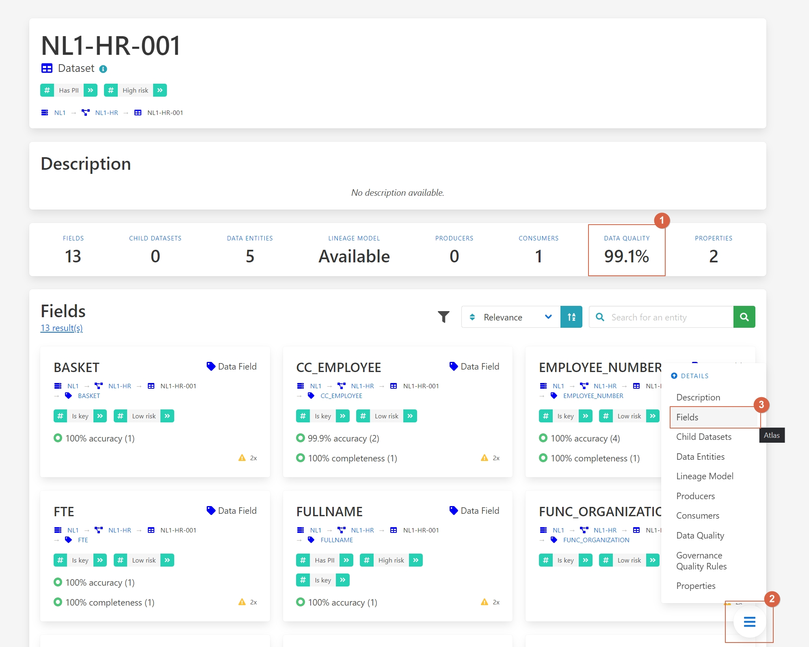
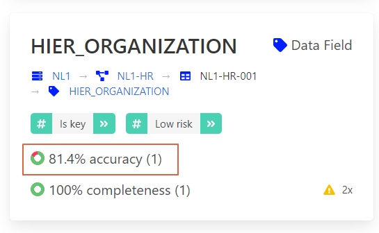

# Enhancing Data Quality Management

Data quality is a crucial aspect of data management, ensuring data is useful and reliable, leading
to better business outcomes. Poor data quality, on the other hand, can result in misleading
indicators, ineffective decision-making, and wasted resources.

## Challenges

1. **Error-Prone Data**: Inaccurate data can lead to wrong business decisions.
2. **Incomplete Data**: Missing values reduce the usability of datasets.
3. **Outdated Data**: Data that is not current can mislead analysis.
4. **Lack of Uniqueness**: Duplicate entries can cause inconsistencies.
5. **Invalid Data**: Data that does not fit predefined formats can lead to processing errors.

## Benefits and Features

- **Comprehensive Data Quality Metrics**: Measures accuracy, completeness, timeliness, uniqueness, and validity.
- **Data Quality Scoring**: Provides a percentage score for each quality rule, highlighting areas of improvement.
- **Root Cause Analysis**: Helps identify and address the origins of data quality issues.
- **Cross-Platform Data Quality Insights**: Tracks data quality across different systems and transformations.

## Walkthrough

Consider a data engineer who needs high-quality data for a new analysis. The engineer uses
Aurelius Atlas to discover and evaluate the data quality of a candidate dataset.

!!! tip
    You can follow along with the scenario on the Aurelius Atlas demo environment.

    <a class="btn btn-success" href="https://aureliusdev.westeurope.cloudapp.azure.com/demo/atlas/">Go to the demo</a>

Watch the video walkthrough below or read the step-by-step instructions.

<iframe
    width="560"
    height="315"
    src="https://www.youtube.com/embed/QBZ80l5jpvE?si=nWc-ig7RxbGnq8ce"
    title="YouTube video player"
    frameborder="0"
    allow="accelerometer; autoplay; clipboard-write; encrypted-media; gyroscope; picture-in-picture; web-share"
    referrerpolicy="strict-origin-when-cross-origin"
    allowfullscreen
>
</iframe>

### Step-by-Step Guide

Imagine you're a data engineer tasked with ensuring high-quality data for a new analysis using Aurelius Atlas.
Start by navigating directly to the details page of the dataset you intend to use.

\[\]
(../img/screenshots/data-governance-quality/data-quality-01.jpg)

Here, you'll find an overview of its data quality metrics, which include measures such as accuracy, completeness,
timeliness, uniqueness, and validity. This initial view allows you to understand the overall quality status of
the dataset.

Next, assess the quality of each field by navigating to the field details section.

\[\]
(../img/screenshots/data-governance-quality/data-quality-02.jpg)

This section provides a detailed view of each field's quality, helping you identify areas that may require
improvement. For instance, you might notice that fields like "FTE" and "location" meet your quality standards,
while others, such as "HIER ORGANIZATION" exhibit lower precision.

To gain deeper insights into the specific data quality issues affecting "HIER ORGANIZATION" navigate to the data
quality rules section.

\[\]
(../img/screenshots/data-governance-quality/data-quality-03.jpg)

Here, you can review all applied rules and their respective scores. For example, you might discover that
inconsistencies in the syntax of the "HIER ORGANIZATION" field contribute to its lower quality score.

To understand the implications of these findings and identify who within your organization is responsible for
addressing these quality issues, navigate to the data attributes section.

\[\]
(../img/screenshots/data-governance-quality/data-quality-04.jpg)

This section provides detailed information about each attribute, including contact details for individuals
accountable for the data. It helps you understand what each field represents and enables you to collaborate
effectively to enhance data accuracy, completeness, and reliability for your analysis.

By following these steps in Aurelius Atlas, you gain clarity on the quality measures applied to your dataset and
can take actionable steps to ensure high-quality data for your analysis.
