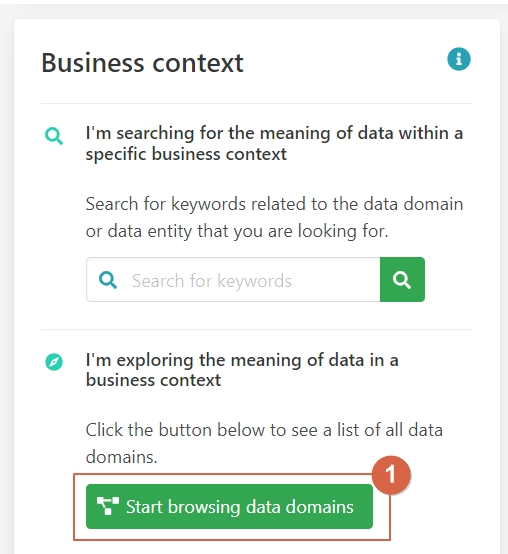

# Monitoring Data Governance Quality

Implementing data management in an organization involves multiple facets: setting up the data governance
organization, establishing business and technical data governance models, and monitoring data quality. Keeping
track of progress across these activities can be challenging. Aurelius Atlas provides a comprehensive tool for
key stakeholders to monitor implementation progress and data governance quality, aiding better decision-making
for future improvements.

## Challenges

1. **Comprehensive Oversight**: Difficulty in monitoring progress across various data governance activities.
2. **Quality Assurance**: Ensuring data governance rules are followed across the organization.
3. **Prioritization**: Identifying areas needing immediate attention for improvement.
4. **Transparency**: Communicating the status of data governance compliance to stakeholders.

## Benefits and Features

- **Holistic Monitoring**: Track implementation progress and data governance quality.
- **Rule Compliance**: Assess compliance with data governance rules for each entity.
- **Quality Scores**: Provide overall data governance quality scores for entities.
- **Actionable Insights**: Identify potential issues and focus on necessary improvements.

## Walkthrough

Consider a business data steward responsible for maintaining data governance quality in their domain. The steward
uses Aurelius Atlas to review potential issues and delve into the details.

!!! tip
    You can follow along with the scenario on the Aurelius Atlas demo environment.

    <a class="btn btn-success" href="https://aureliusdev.westeurope.cloudapp.azure.com/demo/atlas/">Go to the demo</a>

Watch the video walkthrough below or read the step-by-step instructions.

<iframe
    width="560"
    height="315"
    src="https://www.youtube.com/embed/q6yFKAfdbSk?si=Rm-DLwhgZdBGksc1"
    title="YouTube video player"
    frameborder="0"
    allow="accelerometer; autoplay; clipboard-write; encrypted-media; gyroscope; picture-in-picture; web-share"
    referrerpolicy="strict-origin-when-cross-origin"
    allowfullscreen
>
</iframe>

### Step-by-Step Guide

Let's begin by searching for the "Logistics" domain within Aurelius Atlas to assess its data governance quality.
Click on the button as shown in the image below:

\[\]
(../img/screenshots/data-quality-management/data-management-01.jpg)

Icons such as data type indicators, check marks for fully populated entities, and warning symbols for incomplete
ones help us quickly identify areas needing attention.

Next, click on the "Logistics" entity flagged with a warning symbol to investigate further:

\[\]
(../img/screenshots/data-quality-management/data-management-02.jpg)

This section provides a detailed view of each field's quality, helping you identify areas that may require
improvement. For instance, you might notice that fields like "FTE" and "location" meet your quality standards,
while others, such as "HIER ORGANIZATION" exhibit lower precision.

To gain deeper insights into the specific data quality issues affecting "HIER ORGANIZATION" navigate to the data
quality rules section.

Here, you can assess the compliance status of the "Logistics" entity with the applied data governance rules:

\[\]
(../img/screenshots/data-quality-management/data-management-04.jpg)

Check if all required data entities are complete or if there are any missing elements that require attention.

By following these steps, you can effectively monitor and improve data governance quality, ensuring compliance
with established rules and standards across your organization.
