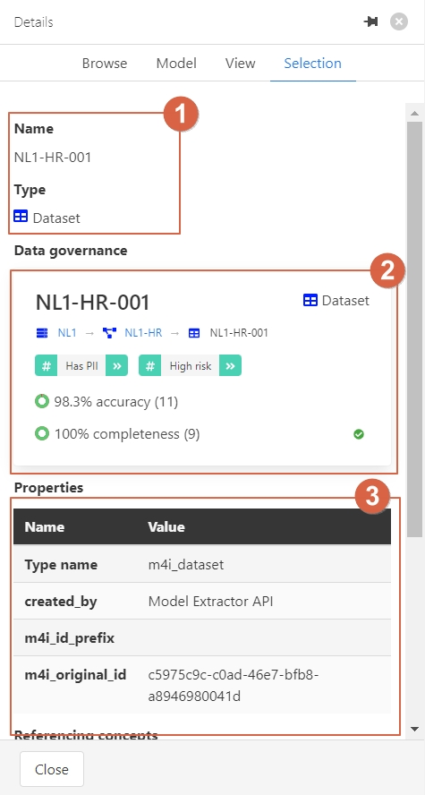
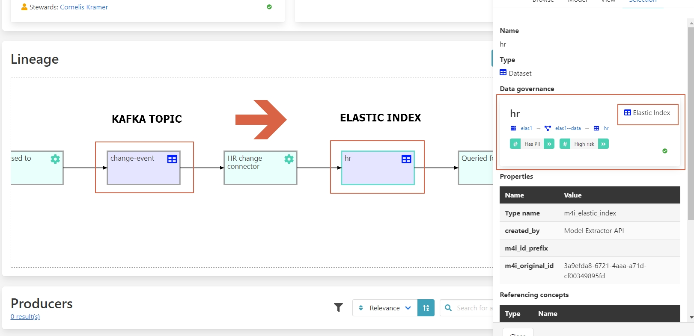

# Streamlining Data Impact Analysis

In organizations, data from various sources undergoes transformation using
specific technologies, involving multiple steps where changes can impact
downstream processes. Data scientists and integration experts rely on
impact analysis to assess these effects. They face challenges such as
dependency management, unclear data lineage, complex impact assessment,
and identifying ownership.

## Challenges

1. **Dependency Management**: Overlooking dependent steps can lead to data processing failures.
2. **Data Lineage Clarity**: Lack of visibility into data flow complicates tracing origins.
3. **Impact Assessment**: Assessing changes across interconnected systems is time-consuming.
4. **Ownership Identification**: Identifying responsible parties for data usage is challenging.

## Benefits and Features

- **Data Integrity**: Visualizing data lineage ensures reliability.
- **Change Management**: Tools assess schema or transformation impacts.
- **Data Governance**: Tracks data usage and responsibilities.
- **Efficiency**: Centralized access accelerates decision-making.

## Walkthrough

Consider an implementer extending a table schema to ensure subsequent
processing adjustments.

### Step-by-Step Guide

The table we want to extend is **NL1-HR-001**. Since we're interested in the
technical specifications of the table, use the Technical Context
search input and search for **NL1-HR-001**.

We will receive a list of all results related to **NL1-HR-001**. We are
interested in the table, so click on the entity **NL1-HR-001** with type _Dataset_.
0

In this overview, we find the following segments:

1. Name and type of the entity.
2. Breadcrumb showing the entity hierarchy.
3. Description of the entity.
4. Summary of all page elements.
5. Lineage model availability.
6. Navigation button for quick access.

We are looking for the data lineage. Therefore, click on _Lineage Model_
in segment (5) or use the navigation button (6).

The lineage model shows the position of the entity in the data flow. It clarifies
where the data comes from and where it flows to. In this case, we see that the
entity **NL1-HR-001** is a source dataset used and processed in the organization.

To get details of each entity in the lineage model, click on the icon in the
image to open the detail panel on the right-hand side.

In the details, we find:

1. Name and type of the entity.
2. Summary of data governance metrics.
3. Properties of the entity.

Let’s follow the flow of the data. If you click on the next entity called Change-event,
you can see how the data changes to a Kafka topic. Thereafter, you can see
that this Kafka topic converts into an Elastic index.

With the lineage graph, you can see where the data is going and where it comes from.
This is not limited to a particular system but spans across different
applications and environments tracking governance information. Following these steps,
the implementer can learn where the data is used and what subsequent processing can
be affected by extending the schema.
